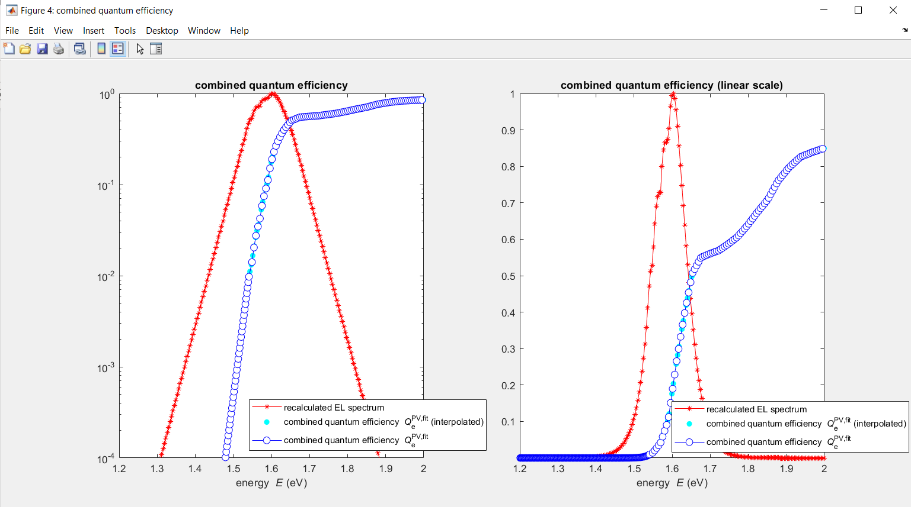

## Standardized Method to Report Perovskite Solar Cell VOC Losses and QeLED

* [Overview of Script and Functionality](#Overview)
* [Script Checklist](#Checklist)
* [Procedure](#Procedure)
* [Results/Output](#Results)
* [Troubleshooting](#Troubleshooting)

## Overview

SCRIPT_Vocrad_EQE_fit_Urbachtail_NRVocLoss_QLED.m

This script determines the maximum achievable open circuit voltage, VOCrad  (i.e. the VOC in the radiative limit), of your solar cell from the real optical response of the device by evaluating your external quantum efficiency (EQE) data. In addition, it calculates the non-radiative voltage losses (∆VOCNR) and the corresponding external luminescence quantum efficiency (QeLED) with the input of the measured VOC.

**Figure**. Screenshot of the main MATLAB script used to calculate VOCrad, ∆VOCNR, and QeLED.

## Checklist
In order to use this MATLAB script, you will need the following scripts and data files, which need to be contained in the same file directory.
1) Main MATLAB script: SCRIPT_Vocrad_EQE_fit_Urbachtail_NRVocLoss_QLED.m

2) Additional MATLAB function:
	The MATLAB function efficiency.m calculates the efficiency and characteristic parameters of a solar cell under AM1.5g illumination
	
3) Data set files:
- AM15G.dat is the AM1.5 global solar irradiance spectrum which is used as illumination source for the solar cell (first column: energy in eV, second column: photon flux in s-1cm-2(eV)-1)

- The EQE dataset of the perovskite solar cell for which you want to determine the maximum achievable VOC. The EQE data (second column) of your solar cell can be in absolute values or percentage-% with respect to energy (eV) or wavelength (nm), which will be in the first column. The data format options are .dat, .txt, .csv, .xls. The dataset will be converted to energy in eV and EQE in absolute values. In this example: EQE_Liu_ACSEnergyLett_19_recipeB.dat 

- LiteratureSurvey.xlsx contains a selection of pioneering perovskite device work that is used to generate a plot to reference and compare your device non-radiative voltage loss and external luminescence quantum efficiency on the same thermodynamic scale (irrespective of band gap and composition).

## Procedure
1) Before you run the script you need to enter the filename of the EQE dataset which you want to analyse. Also enter the measured open-circuit voltage VOC (V) and the power conversion efficiency PCE (%) of your device.

**Figure.** Screenshot of script showing where data and values should be input.

2) Run the Script. A figure window pops up showing the EQE data over energy on a semi-logarithmic scale. Here you will need to select the energy region across the absorption onset (red square below) over which an Urbach tail will be fit. 
3) Zoom in. 

**Figure.** Measured device raw EQE data as a function of energy (eV).

4) Pick two data points with your mouse by holding ALT or SHIFT.
	i. First select a data point at the lower enegy end of the bandgap tail. 
	ii. Next, select a second data point at the start of the bandgap tail (higher energy). 
	iii. Then press enter or (almost) any other key to continue.

**Figure.** Zoomed in window of the measured EQE data versus energy (eV) and an example of selecting data points over which to fit the Urbach tail.

When the MATLAB script is finished running, five more figures will appear, the workspace fills with variables and important results are saved as respective .dat files and .mat files.
The quality of the Urbach tail fit can be evaluated by checking:

1) That the slope of the tail matches your experimental data. If it does not match, you can adjust it manually by changing the Urbach tail energy (E_Urbach) (eV) in the script.

**Figure.** Combined quantum efficiency data of the measured EQE (red circles) and an Urbach tail fit (black line and blue circles). The coordinates where data has been extrapolated and stitched is marked as the transition point (pink square).

2) The shape of the predicted electroluminescence spectrum. For traditional metal halide perovskites, the spectrum should appear symmetric about the mean emission energy. The Urbach tail can be manually adjusted so that the EL spectrum looks like you would expect. Typical Urbach energies range from 13-17 meV.

**Figure.** Combined external quantum efficiency (blue) and the corresponding electroluminescence (EL) spectrum (red) calculated from the opto-electronic reciprocity theorem. 
 
## Results
Graphical representations of the calculated results are presented in the final two figures. Using the full extrapolated EQE spectrum, the maximum theoretical VOCrad is calculated and reported in the bar graph shown below. This is compared to your measured device VOC and used to calculate the non-radiative voltage loss ∆VOCNR (i.e. VOCrad-VOC). This value can be compared to any other perovskite devices independent of composition and bandgap energy.

**Figure.** Bar chart of your device ∆VOC, VOCrad, and ∆VOCNR.

The final plot shows ∆V_oc^NR as well as the external luminescence quantum efficiency (QeLED), compared to a selection of pioneering perovskite device papers from literature.** This allows you to directly compare your device voltage and implied external luminescence efficiency to the best in the field. If you do not want to script to perform this comparsion, set comparsion_literature='no'.
 

**Figure.** Power conversion efficiency (PCE) versus QeLED and ∆V_oc^NR of a selection of pioneering perovskite device work along with your data overlaid in red.
 
## Access to Saved Data and Results
To acess the calculated values in the radiative limit, open the variable RESULTS_rad_limit or variable Voc_rad (V). The variable NR_Voc_loss states you non-radiative voltages losses (V), and QeLED the external luminescence quantum efficiency (%), which is often referred to as the external radiative efficiency or LED quantum efficiency.

**Figure.** Screenshot of the RESULTS_rad_limit table showing the calculated VOCrad.
 
## Troubleshooting
- The script can also be tested with the exemplary dataset (EQE_Liu_ACSEnergyLett_19_recipeB.dat) to test whether your EQE code is importing correctly.

- If the combined quantum efficiency data does not look correct, you can change the transition point (EQE_level) manually. The point should be somewhere where your measured EQE has a high signal-to-noise ratio. You can switch manually to ‘yes‘, otherwise the transition point will be picked automatically.

- Data is interpolated to get more data points in the energy range at the bandgap tail. Experimental datasets often have only a few points in this range and the calculation is more precise with higher energy resolution. If you don’t want to use this interpolation, uncomment lines 98-101.
 

**Figure.** Measured EQE data (blue) versus energy and an interpolated version of the data set (red). 

